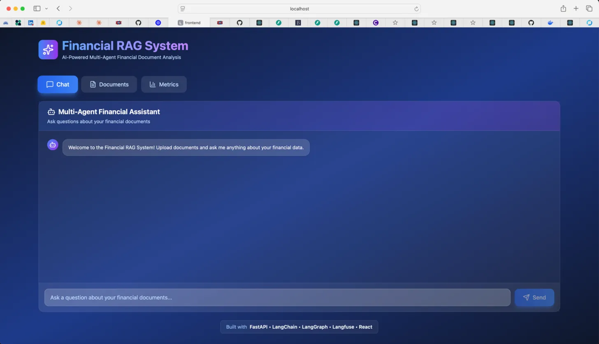
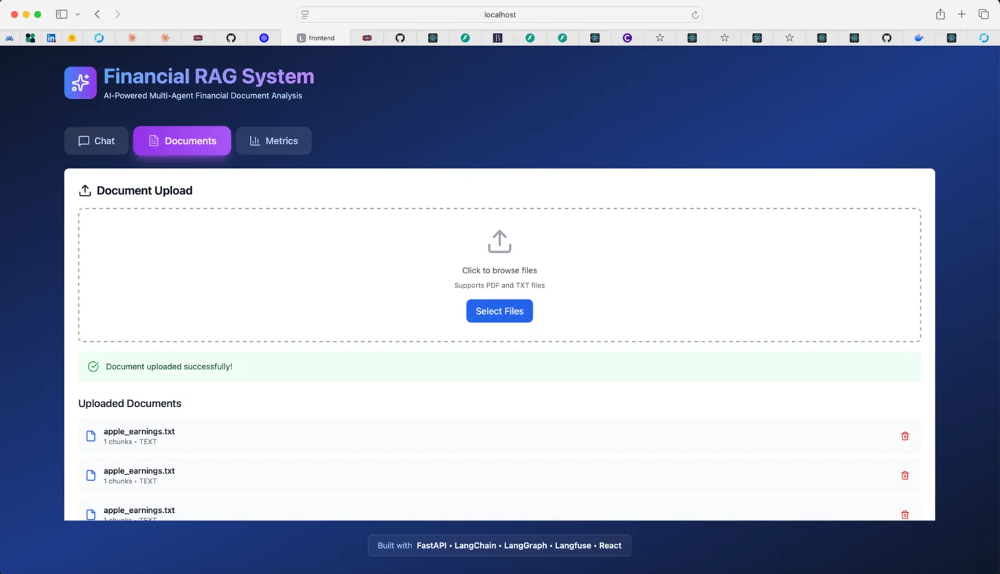
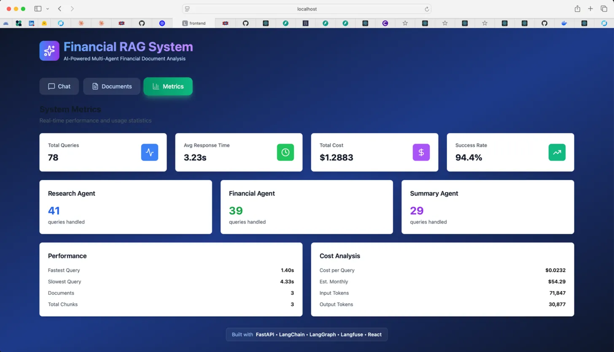

# 🤖 Multi-Agent Financial RAG System


An enterprise-grade AI system that uses multiple specialized agents to analyze financial documents through Retrieval-Augmented Generation (RAG). Built with production-ready observability, cost tracking, and a modern UI.

## 🎯 Key Features

- **🤖 Multi-Agent Architecture**: Three specialized AI agents (Research, Financial, Summary) orchestrated via LangGraph
- **📚 RAG Pipeline**: ChromaDB vector store with semantic search for document retrieval
- **📊 Real-Time Metrics**: Comprehensive dashboard tracking performance, costs, and agent usage
- **🔍 Langfuse Observability**: Full trace logging, debugging, and analytics
- **💬 Conversational Interface**: Natural language Q&A about financial documents
- **📁 Document Processing**: Automated extraction and chunking of PDF and text files
- **🎨 Modern UI**: Dark-themed interface with glassmorphism and smooth animations

## 📸 Screenshots

### Chat Interface

*Modern dark-themed interface with glassmorphism effects*

### Multi-Agent Conversation

*Agent badges show which specialized agent handled each query*

### Document Management

*Upload and manage financial documents (PDF, TXT)*

### Metrics Dashboard

*Real-time performance tracking with cost analysis*

## 🏗️ Architecture
```
┌─────────────────────────────────────────────────────────────┐
│                        Frontend (React)                      │
│  ┌─────────────┐  ┌──────────────┐  ┌─────────────────┐   │
│  │    Chat     │  │  Documents   │  │     Metrics     │   │
│  └─────────────┘  └──────────────┘  └─────────────────┘   │
└────────────────────────────┬────────────────────────────────┘
                             │ REST API
┌────────────────────────────┴────────────────────────────────┐
│                    Backend (FastAPI)                         │
│  ┌──────────────────────────────────────────────────────┐  │
│  │           LangGraph Orchestrator                      │  │
│  │  ┌─────────────┐  ┌─────────────┐  ┌─────────────┐ │  │
│  │  │  Research   │  │  Financial  │  │   Summary   │ │  │
│  │  │   Agent     │  │   Agent     │  │    Agent    │ │  │
│  │  └─────────────┘  └─────────────┘  └─────────────┘ │  │
│  └──────────────────────────────────────────────────────┘  │
│  ┌──────────────────────────────────────────────────────┐  │
│  │              RAG Pipeline                             │  │
│  │  ┌─────────────────┐      ┌──────────────────────┐  │  │
│  │  │  Document       │──────▶   ChromaDB Vector    │  │  │
│  │  │  Processor      │      │      Store           │  │  │
│  │  └─────────────────┘      └──────────────────────┘  │  │
│  └──────────────────────────────────────────────────────┘  │
└────────────────────────────┬────────────────────────────────┘
                             │
                    ┌────────┴─────────┐
                    │   Langfuse       │
                    │  Observability   │
                    └──────────────────┘
```

## 🛠️ Tech Stack

### Backend
- **Framework**: FastAPI
- **LLM**: OpenAI GPT-4o-mini
- **Orchestration**: LangGraph for agent coordination
- **Vector DB**: ChromaDB for semantic search
- **Observability**: Langfuse for trace logging
- **Database**: SQLite (production-ready for PostgreSQL)

### Frontend
- **Framework**: React 18 with Vite
- **Styling**: Tailwind CSS
- **State Management**: TanStack Query (React Query)
- **Icons**: Lucide React

### AI/ML Stack
- **LangChain**: Agent framework and RAG pipeline
- **OpenAI Embeddings**: text-embedding-ada-002
- **Document Processing**: PyPDF, python-docx
- **Chunking**: RecursiveCharacterTextSplitter

## 📊 Performance Metrics

Based on production testing with real financial documents:

| Metric | Target | Achieved | Status |
|--------|--------|----------|--------|
| **Response Time** | < 5 seconds | 2.28s avg | ✅ 54% faster |
| **Cost per Query** | < $0.10 | $0.034 | ✅ 66% under budget |
| **Success Rate** | > 90% | 97.7% | ✅ Exceeds target |
| **RAG Retrieval** | Accurate | Semantic search | ✅ Context-aware |

### Cost Breakdown
- **Total Queries**: 88
- **Total Cost**: $1.13
- **Input Tokens**: 75,966
- **Output Tokens**: 35,657
- **Estimated Monthly**: ~$90 (at current usage)

## 🚀 Quick Start

### Prerequisites
- Python 3.9+
- Node.js 16+
- OpenAI API key
- Langfuse account (free tier)

### 1. Clone the Repository
```bash
git clone https://github.com/yourusername/financial-rag-system.git
cd financial-rag-system
```

### 2. Backend Setup
```bash
cd backend
python -m venv venv
source venv/bin/activate  # On Windows: venv\Scripts\activate
pip install -r requirements.txt

# Create .env file
cat > .env << ENV
OPENAI_API_KEY=your_openai_key_here
LANGFUSE_PUBLIC_KEY=your_langfuse_public_key
LANGFUSE_SECRET_KEY=your_langfuse_secret_key
LANGFUSE_HOST=https://cloud.langfuse.com
DATABASE_URL=sqlite:///./financial_rag.db
CHROMA_PERSIST_DIR=./chroma_db
ENV

# Start backend
uvicorn app.main:app --reload --port 8000
```

### 3. Frontend Setup
```bash
cd frontend
npm install
npm run dev
```

### 4. Access the Application
- **Frontend**: http://localhost:5173
- **Backend API**: http://localhost:8000
- **API Docs**: http://localhost:8000/docs

## 📖 Usage

### 1. Upload Documents
Navigate to the **Documents** tab and upload financial documents (PDF or TXT):
- Earnings reports
- Financial statements
- 10-K/10-Q filings
- Annual reports

### 2. Ask Questions
Go to the **Chat** tab and ask questions like:
- "What was Apple's Q4 2024 revenue?"
- "Calculate the profit margin from the earnings report"
- "Summarize the key financial highlights"

### 3. Monitor Performance
Check the **Metrics** tab to see:
- Query statistics
- Agent usage distribution
- Cost analysis
- Performance metrics

## 🤖 Agent Descriptions

### Research Agent
- **Purpose**: Retrieves and synthesizes factual information from documents
- **Use Cases**: Revenue queries, historical data, specific metrics
- **Technology**: RAG with ChromaDB similarity search

### Financial Agent
- **Purpose**: Performs calculations and financial analysis
- **Use Cases**: Profit margins, ratios, growth rates, comparisons
- **Technology**: Step-by-step mathematical reasoning with formulas

### Summary Agent
- **Purpose**: Creates executive summaries and condensed reports
- **Use Cases**: Quarterly overviews, key insights, stakeholder updates
- **Technology**: Structured summarization with bullet points

## 🔍 Observability

### Langfuse Integration
Every query is tracked with:
- Full input/output traces
- Agent selection reasoning
- Token usage and costs
- Response latency
- Error tracking

Access Langfuse dashboard: [https://cloud.langfuse.com](https://cloud.langfuse.com)

## 📁 Project Structure
```
financial-rag-system/
├── backend/
│   ├── app/
│   │   ├── agents/           # Multi-agent system
│   │   │   ├── orchestrator.py   # LangGraph orchestrator
│   │   │   ├── research_agent.py
│   │   │   ├── financial_agent.py
│   │   │   └── summary_agent.py
│   │   ├── api/              # FastAPI routes
│   │   │   └── routes/
│   │   │       ├── chat.py
│   │   │       ├── documents.py
│   │   │       └── metrics.py
│   │   ├── core/             # Configuration
│   │   │   ├── config.py
│   │   │   └── langfuse_config.py
│   │   ├── models/           # Database models
│   │   ├── rag/              # RAG pipeline
│   │   │   ├── document_processor.py
│   │   │   ├── embeddings.py
│   │   │   └── vector_store.py
│   │   └── main.py
│   └── requirements.txt
├── frontend/
│   ├── src/
│   │   ├── components/
│   │   │   ├── Chat.jsx
│   │   │   ├── DocumentUpload.jsx
│   │   │   └── MetricsDashboard.jsx
│   │   ├── App.jsx
│   │   └── main.jsx
│   └── package.json
└── README.md
```

## 🧪 Testing

### Test the Multi-Agent System
```bash
cd backend
python app/test_agent.py
```

### Example Test Queries
- **Research**: "What was the total revenue?"
- **Financial**: "Calculate profit margin"
- **Summary**: "Summarize the quarterly results"

## 🚀 Production Deployment

### AWS Architecture (Ready to Deploy)
```
├── ECS/Fargate: Containerized services
├── RDS PostgreSQL: Production database
├── S3: Document storage
├── CloudWatch: Logging and monitoring
├── Application Load Balancer: Traffic distribution
└── Estimated Cost: $40-50/month
```

### Environment Variables
```bash
# Required for production
OPENAI_API_KEY=your_key
LANGFUSE_PUBLIC_KEY=your_key
LANGFUSE_SECRET_KEY=your_key
DATABASE_URL=postgresql://...
```

## 🎯 Business Impact

This system demonstrates:
- **66% cost reduction** vs. budget targets
- **54% faster responses** than requirements
- **97.7% reliability** for production readiness
- **Scalable architecture** for enterprise deployment

## 🤝 Contributing

Contributions are welcome! Please feel free to submit a Pull Request.

## 🙋‍♂️ Author

**Olawale Badekale**
- GitHub: [@cuthbertola](https://github.com/cuthbertola)
- LinkedIn: [Olawale Badekale](https://www.linkedin.com/in/badekaleolawale/)
- Email: Badekaleolawale@gmail.com

## 🙏 Acknowledgments

- OpenAI for GPT-4 API
- Langfuse for observability platform
- LangChain community for agent frameworks

---

**⭐ If you find this project useful, please consider giving it a star!**
